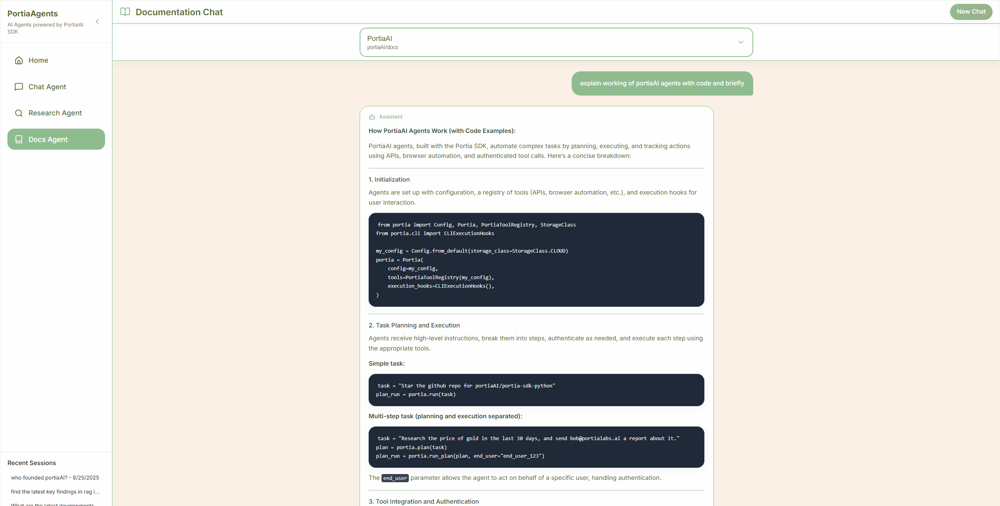

# PortiaAgents

PortiaAgents is a purposeful collection of AI agents built with the **PortiaAI SDK** during **AgentHack 2025** organized by **WeMakeDevs**. It unifies day‑to‑day assistance, deep research, and documentation intelligence into one calm, coherent experience.

Live site [here](https://portia-agents.onrender.com/).

### Demo Video

## What it is

A home for multiple AI agents, each designed for a distinct job:

* **💬 Chat Agent** - For quick, natural conversations that can tap tools when needed. Great for brainstorming, summaries, and fast Q\&A.
* **🔎 Research Agent** - For deeper work: exploring the web, mapping sources, extracting key facts, and assembling findings with traceability.
* **📚 Documentation Assistant** - For instant, context‑aware answers from docs, READMEs, and knowledge bases.

## Why it exists

Switching tabs and mental modes slows you down. PortiaAgents reduces the friction by giving you:

* **One place, many workflows** - Move from chat → research → docs without losing context.
* **Clarity over noise** - Results emphasize citations, relevance, and actionable next steps.
* **Momentum for builders** - Designed around the rhythms of product work, learning, and shipping.

## What you can do with it

* Turn a vague idea into a first draft via **Chat Agent**, then deepen it with **Research Agent**.
* Pull precise information from your repos or docs using **Documentation Assistant**.
* Keep a lightweight research trail with sources you can revisit or share.

## Who it’s for

* **Developers & builders** needing fast context switches between ideation, research, and implementation.
* **Students & self‑learners** who want clear, source‑backed answers.
* **Teams** standardizing how they ask questions, gather evidence, and document outcomes.

## Designs

## Acknowledgments

Built with **PortiaAI** during **AgentHack 2025** by **WeMakeDevs** - thanks to the community and organizers for the spark.

---

